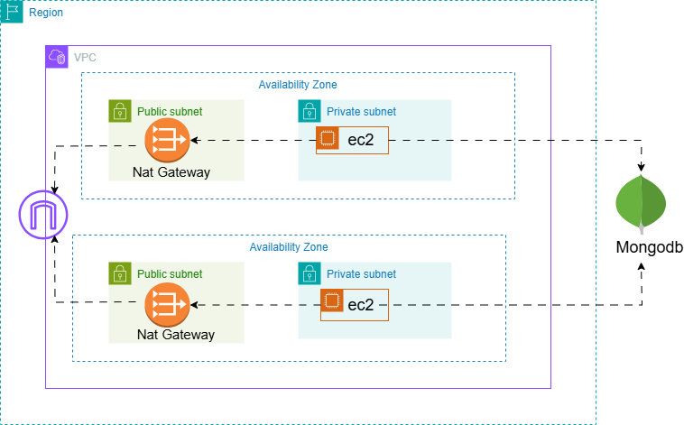

# Number Combination Generator App



This project is a **Number Combination Generator** application built using **Node.js** as the JavaScript runtime environment.  
The application is hosted on an **AWS EC2** instance and uses **MongoDB Atlas** as the database.

## Resources Used

- **AWS Account** (for hosting the application)
- **MongoDB Atlas Account** (for managing the database)
- **Node.js Application** (server-side development)
---
## Project Setup

Follow these steps to set up and deploy the Number Combination Generator App:

1. **Launch an EC2 Instance**  
   - **Sign in to AWS Management Console** and navigate to the EC2 Dashboard.  
   - **Choose "Launch Instance"** and select an Amazon Machine Image (AMI) and instance type.  
   - **Configure instance details** (network, storage, security group) and set key pairs for SSH access.  
   - **Review and launch** the instance; connect using SSH or EC2 Connect once it's running.

2. **Connect to Your EC2 Instance**  
   - Open your terminal and navigate to the directory where your SSH key is located.  
   - Change the permissions of your key (if not done already):  
     ```bash
     chmod 400 your-key-name.pem
     ```  
   - Use the SSH command to connect to your instance:  
     ```bash
     ssh -i "your-key-name.pem" ec2-user@your-ec2-public-ip
     ```

3. **Install Required Software**  
   - Update your Ubuntu OS:  
     ```bash
     sudo apt update && sudo apt upgrade -y
     ```  
   - Install Node.js, npm, and Git:  
     ```bash
     sudo apt install -y nodejs npm git
     ```

4. **Clone Your Node.js Application**  
   - Clone your Node.js application from GitHub (or your repository):  
     ```bash
     git clone https://github.com/your-username/your-repository.git
     ```

5. **Set Up MongoDB Atlas**  
   - **Sign Up** for MongoDB Atlas if you don't have an account.  
   - **Create a new cluster** in MongoDB Atlas.  
   - **Create a database user** with appropriate privileges for your database.  
   - **Create a database and collection** within MongoDB Atlas to store your app data.  
   - **Copy the connection string** provided by MongoDB Atlas for your cluster.

6. **Integrate MongoDB Atlas with Your Node.js Application**  
   - Update your application's `.env` file with the MongoDB Atlas connection string.  
   - Modify the application code to connect to MongoDB Atlas using the connection string.  
   - Ensure the database configuration is properly set in your code to allow data interaction.

7. **Start Your Node.js Application**  
   - Run the application:  
     ```bash
     npm start
     ```  
   - Access your application by opening a web browser and navigating to:  
     ```
     http://<your-ec2-public-ip>:3000
     ```
---

## Technologies Used
- **Node.js**: JavaScript runtime for building the backend.
- **AWS EC2**: Hosting the application.
- **MongoDB Atlas**: Database for storing data.
- **Express.js**: Web framework for Node.js.
- **MongoDB**: NoSQL database used for storing generated combinations.
- 
---
For more information, refer to the [AWS EC2 Documentation](https://docs.aws.amazon.com/ec2/index.html) and [MongoDB Atlas Documentation](https://www.mongodb.com/docs/atlas/).
